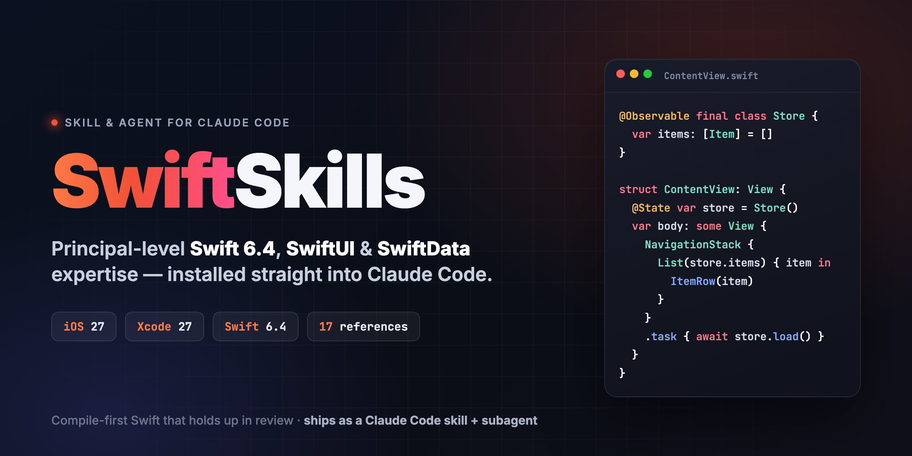

# SwiftSkills



[](LICENSE)
[](https://www.swift.org)
[](https://developer.apple.com)
[](https://claude.com/claude-code)

A **skill and subagent that make [Claude Code](https://claude.com/claude-code) an expert Apple platform engineer** — principal-level Swift 6.4, SwiftUI and SwiftData for the 2027 SDKs (iOS 27, Xcode 27). Drop it into any project or your personal setup and Claude Code writes production Swift that compiles the first time, respects your deployment target, and holds up in review.

Version 1.0.0, built against Swift 6.4 and the WWDC26 SwiftUI and SwiftData releases.

> This is an independent community project and is not affiliated with or endorsed by Apple or Anthropic. It is a Claude Code adaptation of the MIT-licensed [`ios-swift-master-copilot`](https://github.com/sahinraj/ios-swift-master-copilot) skill by Sahin Nisar Raj — see [Credits](#credits).

## Quick start

Clone the repository and install for your user account (all projects on this Mac):

```bash
git clone https://github.com/erkinazizi/SwiftSkills.git
cd SwiftSkills
./install.sh verify
./install.sh personal
```

Then restart Claude Code and run `/agents` — you should see **`ios-swift-master`** listed. That's it.

To install into a single repository so your whole team gets it (committed under `.claude/`):

```bash
./install.sh project ~/path/to/YourApp --claude-md
```

## What you get

- **A skill** (`ios-swift-master`) that Claude Code loads automatically whenever you work on Swift, SwiftUI, SwiftData, Xcode or SPM. It routes each task to the right in-depth reference and enforces a set of non-negotiable correctness rules.
- **A subagent** (`ios-swift-master`) you can hand a whole feature, migration, or code review to — it applies the same rules end to end.
- **17 reference guides** (~200 KB) covering the full Swift language, concurrency, SwiftUI, SwiftData, testing, accessibility, security, performance and more.
- **A `CLAUDE.md`** you can copy into any Swift project for always-on coding rules.

## What's inside

```
SwiftSkills/
├── skills/
│   └── ios-swift-master/
│       ├── SKILL.md                 # routing + non-negotiable rules
│       └── references/              # 17 in-depth guides
├── agents/
│   └── ios-swift-master.md          # Claude Code subagent
├── CLAUDE.md                        # drop-in project coding rules
├── install.sh                       # personal / project installer
├── tests/install_test.sh            # installer smoke test
└── docs/assets/                     # header image + source
```

### Reference topics

| File | Covers |
|---|---|
| `swift-language-guide.md` | Types, optionals, closures, enums, protocols, generics, ARC, access control, errors, macros |
| `swift-language-reference.md` | Grammar, attributes, declarations, patterns, `#if`, availability |
| `swift-whats-new-6x.md` | Swift 6.0 → 6.4 changes and Swift 6 migration |
| `swift-concurrency.md` | async/await, actors, `Sendable`, `@MainActor`, tasks, cancellation |
| `swiftui-dataflow-architecture.md` | `@State`, `@Observable`, `@Environment`, `@Bindable`, stores |
| `swiftui-views-layout-navigation.md` | Layout, lists, navigation, sheets, toolbars, animation, previews |
| `swiftui-performance-identity.md` | Identity, invalidation, slow views, soft-deprecated APIs |
| `swiftui-ios26-ios27-new.md` | Liquid Glass (iOS 26) and every 2027 SwiftUI addition |
| `swiftdata.md` | Models, queries, migrations, CloudKit, observers |
| `testing.md` | Swift Testing, XCTest, UI tests |
| `app-architecture.md` | Architecture, SPM modules, DI, errors, logging |
| `platform-integration.md` | UIKit interop, lifecycle, background, widgets, App Intents, Foundation Models |
| `accessibility-localization.md` | VoiceOver, Dynamic Type, String Catalogs, formatting |
| `networking-security-privacy.md` | URLSession, auth, Keychain, ATS, privacy manifests |
| `performance-debugging.md` | Crashes, hangs, leaks, Instruments, build times |
| `enterprise-ipad.md` | Offline-first, MDM, audit trails, iPad productivity |
| `code-review-checklist.md` | Reviewing a PR or file |

## How it works

Claude Code reads a skill's `description` and pulls the whole skill into context when your request matches — here, any Swift work. The skill's `SKILL.md` is deliberately small: it tells Claude which reference file to open for the task at hand and lays down rules that always apply (no force unwraps in production, `@Observable` over `ObservableObject`, stable `ForEach` identity, `@MainActor` UI, versioned SwiftData migrations, Swift Testing for new tests, and more). Heavy detail lives in `references/`, loaded only when needed, so context stays lean.

The **subagent** is for larger jobs. Ask Claude Code to "use the ios-swift-master agent to migrate this module to Swift 6" and it runs the full context → plan → implement → verify → report workflow in its own context window.

## Install commands

```bash
./install.sh personal [--copy] [--force]        # ~/.claude/skills + ~/.claude/agents
./install.sh project <repo> [--claude-md] [--force]  # <repo>/.claude/ (committable)
./install.sh uninstall-personal
./install.sh uninstall-project <repo>
./install.sh verify [<repo>]
./install.sh help
```

- Personal installs **symlink** by default so `git pull` here updates every project at once. Pass `--copy` if your tooling can't follow symlinks.
- Project installs **copy** the files so you can commit `.claude/` and share them with your team and cloud sessions.
- The installer never clobbers files it didn't create without `--force` (which keeps a timestamped backup).

## Requirements

- macOS with `bash` (the installer). Claude Code itself runs the skill on any platform.
- Xcode 27 / Swift 6.4 to get the most out of the 2027-SDK guidance, though the language and architecture references apply to earlier toolchains too. The skill always checks your project's real deployment target and language mode before using new APIs.

## Contributing

Issues and PRs that improve accuracy, compatibility, or installer safety are welcome — see [CONTRIBUTING.md](CONTRIBUTING.md). Run the checks before opening a PR:

```bash
./install.sh verify
bash tests/install_test.sh
```

## Credits

The skill content and reference guides are adapted from **[ios-swift-master-copilot](https://github.com/sahinraj/ios-swift-master-copilot)** by **Sahin Nisar Raj**, released under the MIT License. SwiftSkills repackages that work as a native Claude Code skill and subagent (Claude Code paths, installer, and project integration) and adds a new README and header image. Full credit for the underlying Swift, SwiftUI and SwiftData guidance goes to the original author.

## License

[MIT](LICENSE) — original guidance © 2026 Sahin Nisar Raj; Claude Code adaptation © 2026 Arkin Azizi.
